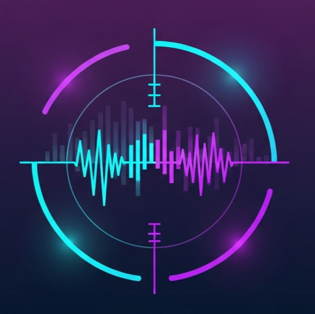

<p align="center">
  
</p>

<h1 align="center">TaskScope</h1>

<p align="center">
  <strong>A modern, beautiful system monitor for Linux & Windows</strong>
</p>

<p align="center">
  
  
  
</p>

---

## ✨ Features

- 🖥️ **Real-time CPU Monitoring** - Total usage, per-core stats, frequency, load average
- 🧠 **Memory Tracking** - RAM usage, cached, available, swap monitoring
- 💾 **Disk Analytics** - Per-partition usage, read/write I/O rates
- 🌐 **Network Monitor** - Per-interface throughput, upload/download speeds
- 📋 **Process Manager** - Search, sort, and kill processes
- 🎨 **Modern UI** - Beautiful dark theme with glass morphism design
- ⚡ **Lightweight** - Minimal resource usage, native performance

---

## 📸 Screenshots

<p align="center">
  
</p>

---

## 🚀 Installation

### Download Binary

Download the latest release for your platform:

| Platform | Download |
|----------|----------|
| 🐧 Linux | [TaskScope](https://github.com/Quoriath/TaskScope/releases/latest/download/TaskScope) |
| 🪟 Windows | [TaskScope.exe](https://github.com/Quoriath/TaskScope/releases/latest/download/TaskScope.exe) |

### Build from Source

**Prerequisites:**
- Go 1.21+
- Node.js 18+
- Wails CLI (`go install github.com/wailsapp/wails/v2/cmd/wails@latest`)

```bash
# Clone repository
git clone https://github.com/Quoriath/TaskScope.git
cd TaskScope

# Install dependencies
cd frontend && npm install && cd ..

# Build
wails build

# Run
./build/bin/TaskScope
```

---

## 🛠️ Tech Stack

| Component | Technology |
|-----------|------------|
| Backend | Go + [gopsutil](https://github.com/shirou/gopsutil) |
| Frontend | HTML/CSS/JS + Tailwind CSS |
| Framework | [Wails](https://wails.io/) |
| Charts | CSS-based sparklines |

---

## ⌨️ Usage

```bash
# Linux
./TaskScope

# Windows
TaskScope.exe
```

### Keyboard Shortcuts

| Key | Action |
|-----|--------|
| `1-6` | Switch tabs (Dashboard, CPU, Memory, Disk, Network, Processes) |
| `Ctrl+F` | Search processes |

---

## 📁 Project Structure

```
TaskScope/
├── app.go              # Backend - system metrics collection
├── main.go             # Wails app entry point
├── frontend/
│   ├── index.html      # UI layout
│   └── src/main.js     # Frontend logic
├── build/
│   ├── bin/            # Compiled binaries
│   └── windows/        # Windows resources
└── TaskScope.png       # App icon
```

---

## 🤝 Contributing

Contributions are welcome! Feel free to:

1. Fork the repository
2. Create a feature branch (`git checkout -b feature/amazing`)
3. Commit changes (`git commit -m 'Add amazing feature'`)
4. Push to branch (`git push origin feature/amazing`)
5. Open a Pull Request

---

## 📄 License

MIT License - feel free to use this project for personal or commercial purposes.

---

<p align="center">
  Made with ❤️ using Go & Wails
</p>
